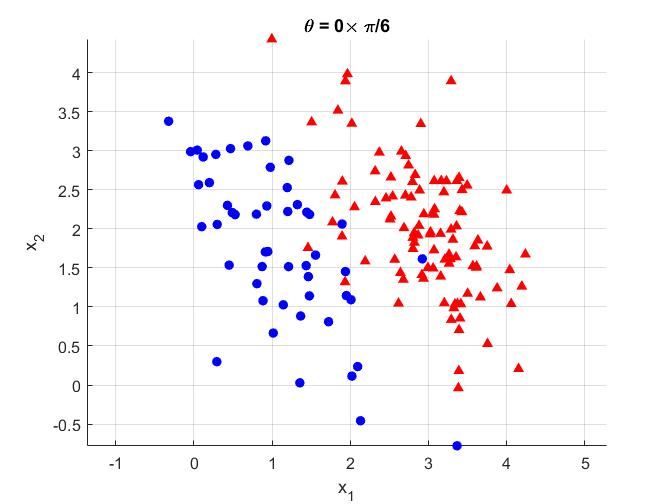
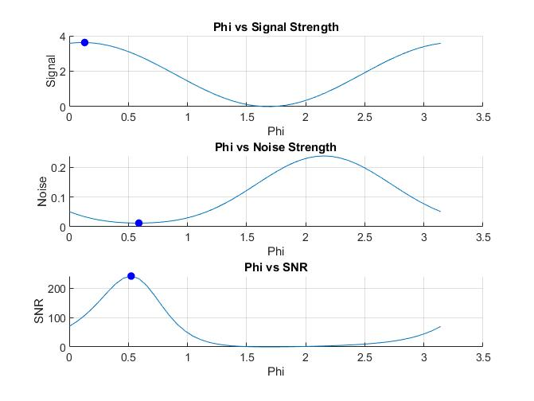
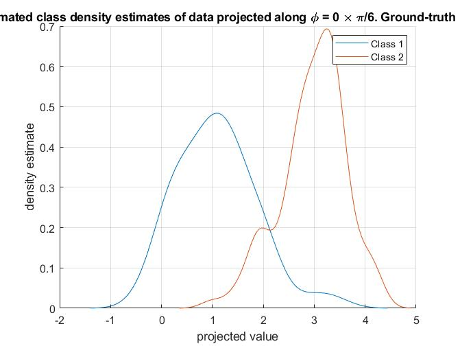
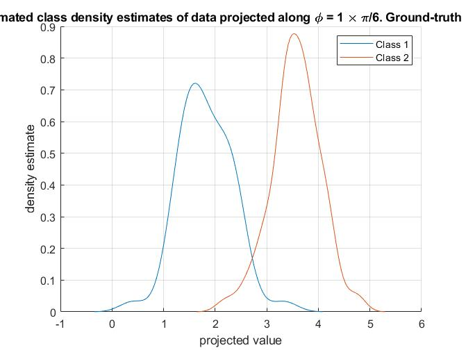
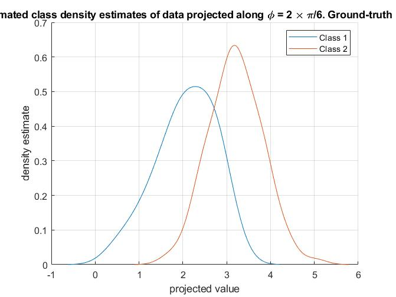
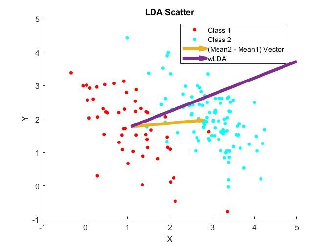
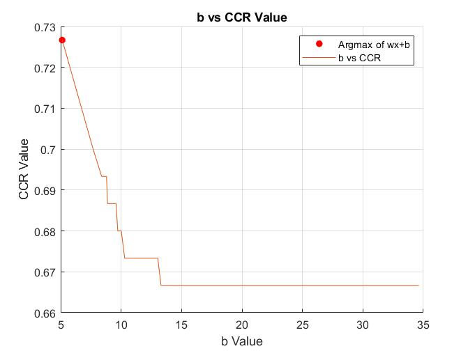

# LDA Implementation
The following folder has an implementation of the Linear Discriminant Analysis (LDA), where the script generates 2 class Gaussian clusters and computes the results for separating the two classes.

## Technical Summary
### LDA.m
The dataset has 2 clusters with different means and variances that is generated using Gaussian random distribution. The two clusters are rotated by π/6.

The function **gaussian2D** is used to generate the dataset, the following are its inputs & outputs:
**Input**
* n1 = number of class 1 examples
* n2 = number of class 2 examples
* mu1 = class 1 mean vector
* mu2 = class 2 mean vector
* theta = orientation of eigenvectors of covariance matrix shared by both classes, used to generate normal multivariate random vector
* lambda1 = first eigenvalue of covariance matrix shared by both classes
* lambda2 = second eigenvalue of covariance matrix shared by both classes

**Output**
* X = 2 by (n1 + n2) matrix with containing class 1 and class 2 feature vectors
* Y = 1 by (n1 + n2) matrix with labels of all (n1 + n2)

To demonstrate that the orientation matters for class separation using LDA, a loop is created to evaluate the Signal-Noise-Ratio versus the orientation (phi) of a line. This is done through the function **snrMetric**, the function casts all points onto a vector pointing in direction phi and evaluates the signal(mean) and noise(variance) of the points on the line.

The following shows the density estimation of the points that is projected onto the line of separation. Each graph represents a line at a certain orientation and two of these lines differs from the actual orientation of the dataset. When the orientation of the dataset and the line of separation match, the overlap region of the two classes is at its minimum.  
Density estimate for phi = 0  |Density estimate for phi = π/6|Density estimate for phi = π/3
:----------------------------:|:----------------------------:|:----------------------------:
   |   |

Using **LDA2D**, the function finds the optimal line to best separate the two classes, optimal would mean maximizing signal and minimizing noise. The optimal line of separation is plotted with a vector directed at the means of two classes.

Intuitively, one may assume that the line of separation is to align with mean of both clusters; however, the variance in the dataset makes it so that is not the case, as shown from the orange and purple lines.

Once the direction of the separating line is decided, the "best" y intercept of the line is decided by using the midpoint of all the casted points as possible candidates. The y-intercept is used to evalute the performance of the line with **compute_ccr**, the highest CCR is the "best" y-intercept.

