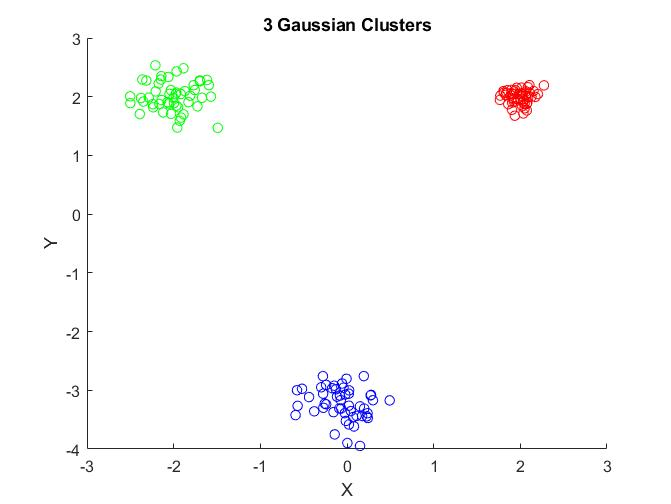
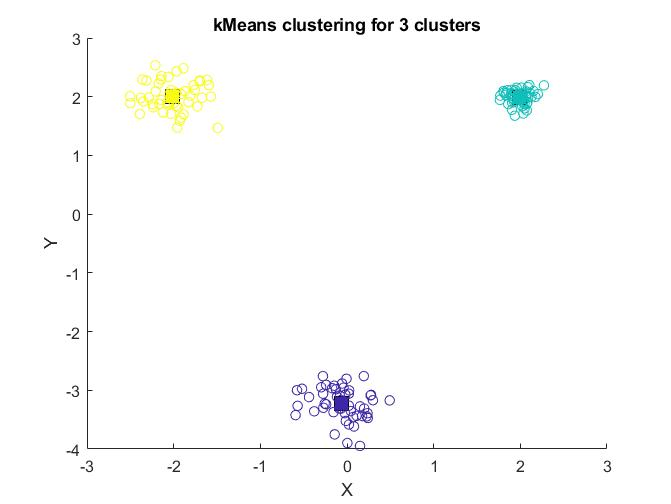
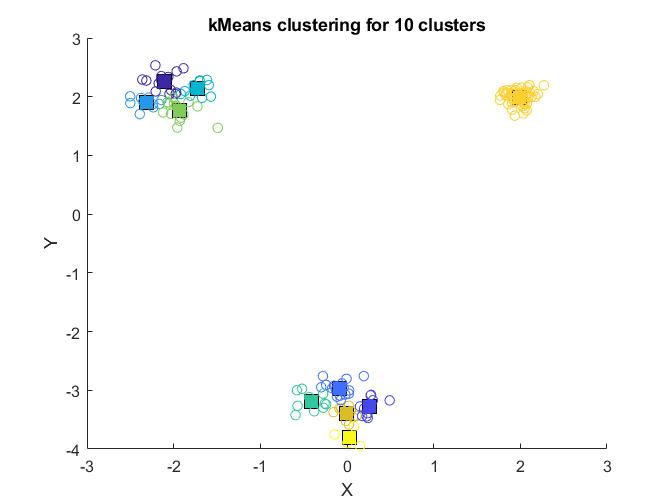
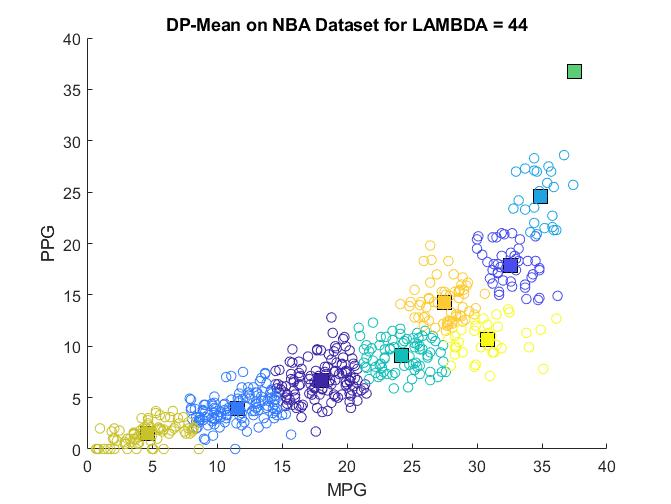
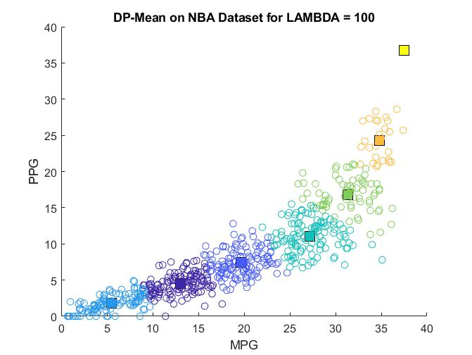
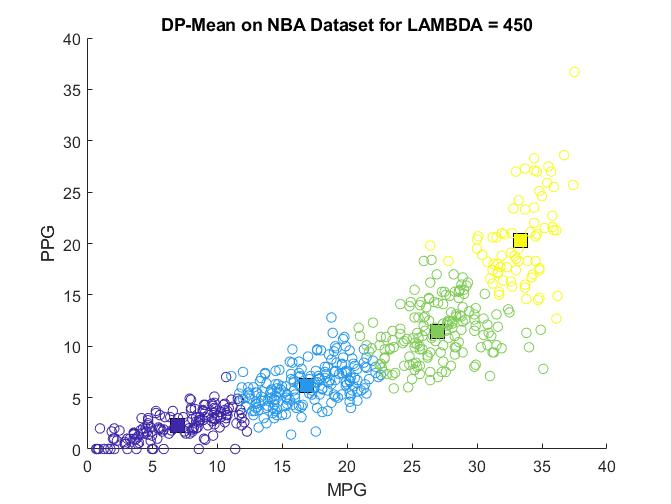

# kNN Implementation
The following folder has 2 implementation of the k-mean clustering algorithm in MATLAB. One implementation uses dynamic programming to try and achieve the minimum k-clustering by finding the lowest WCSS score.

## Technical Summary
### kClusterMean.m
The dataset has 3 clusters with different means and variances that is generated using normal random distribution. The clusters are spread intentionally.

A function **kMean** takes the given dataset and tries to create **N** clusters by seeding **N** cluster means in the dataset. The function then does kMeans and finds the closest points to the cluster and shift towards the cluster's true mean. This is done in a while loop to constantly shift cluster means until the shift is less than the specified **threshold**. The following shows the 3 cluster dataset fitted with K = 3, K = 10.

k-Means with 3 Clusters    |  k-Means with 10 Clusters
:-------------------------:|:-------------------------:
   |  

### kMeanDP.m
The dataset used is the Minutes Per Game (MPG) and Points Per Game (PPG) of 2018 - 2019 NBA data.

**DPMean** takes the NBA dataset and **LAMBDA** as input, the algorithm tries to fit as many clusters of radius **LAMBDA** until all points is within the radius of some cluster. The function runs in a while loop and increases the number of cluster until the following conditions are satisfied:
   1. All distance from cluster mean to points are less than given **LAMBDA**
   2. Recalculation to new mean for cluster doesn't change the original mean
The function will also end once it loops over 500 times to prevent it from being stuck. The following are the results for **LAMBDA** = 44, 100, 450.

DP Clustering for λ = 44   |  DP Clustering for λ = 100|  DP Clustering for λ = 450
:-------------------------:|:-------------------------:|:-------------------------:
     |    |
