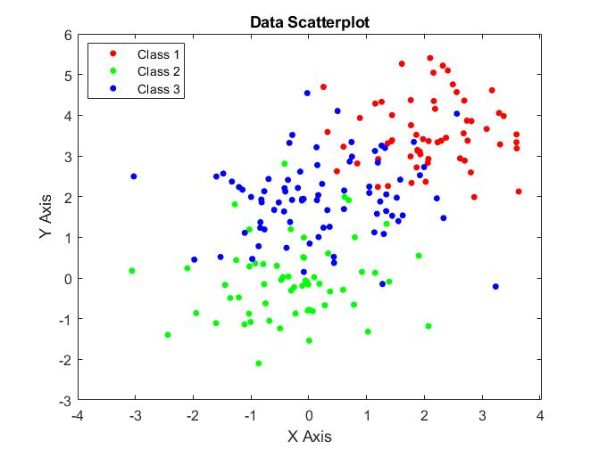
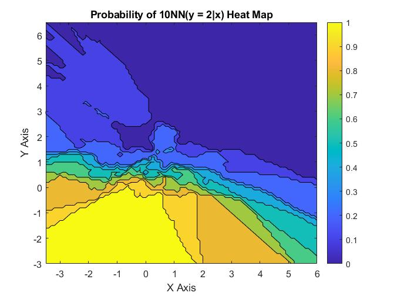
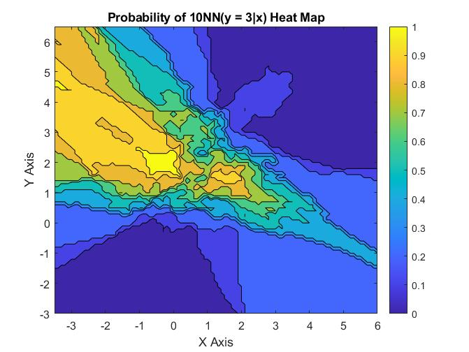
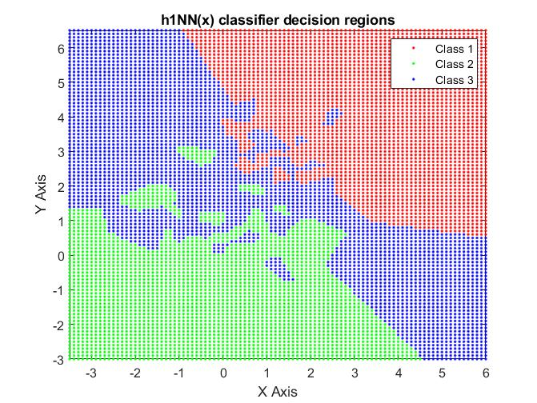
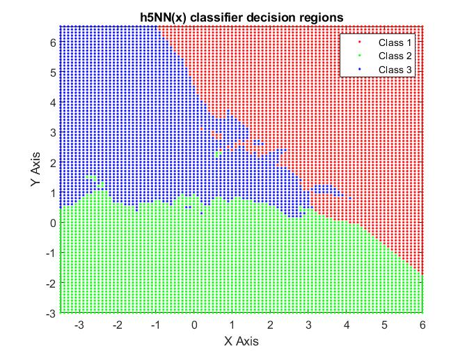

# kNN Implementation
The following folder has 2 implementation of k-Nearest-Neighbor algorithm in MATLAB.

## Technical Summary
### kNN_classifier.m
The **data_knnSimulation** dataset consists of 3 classes on a 2D plane, all classes are not linearly separable from inspection.

A function **heatmap_kNN** is implemented to plot the probability of a certain class being correct on a certain grid. The function takes the number of nearest neighbors, class, label & dataset to determine the probability of a certain class occurring on a certain point in a grid mesh. The following demonstration uses 10 Nearest Neighbor and plots for class 2 and 3.

**labelmap_kNN** is the next function that is implemented, instead of showing a heatmap/probability of a point on a grid being a certain class, its more decisive and only shows the most probable class appearing at a certain point. The following demonstrates 1 and 5 Nearest Neighbors.

### oneNN_numbers.m
The **data_mnist_test** and **data_mnist_train** sets are numbers in black and white that are used to train a 1NN model.

No graphics are made for this exercise, the exercise was just to practice dealing with larger datasets. The code compares a testing and training set of black and white numbers, the label prediction is done by computing the Euclidean distance of each image in the testing set to all 60000 images in the training set. The minimum distance is used as the prediction.
